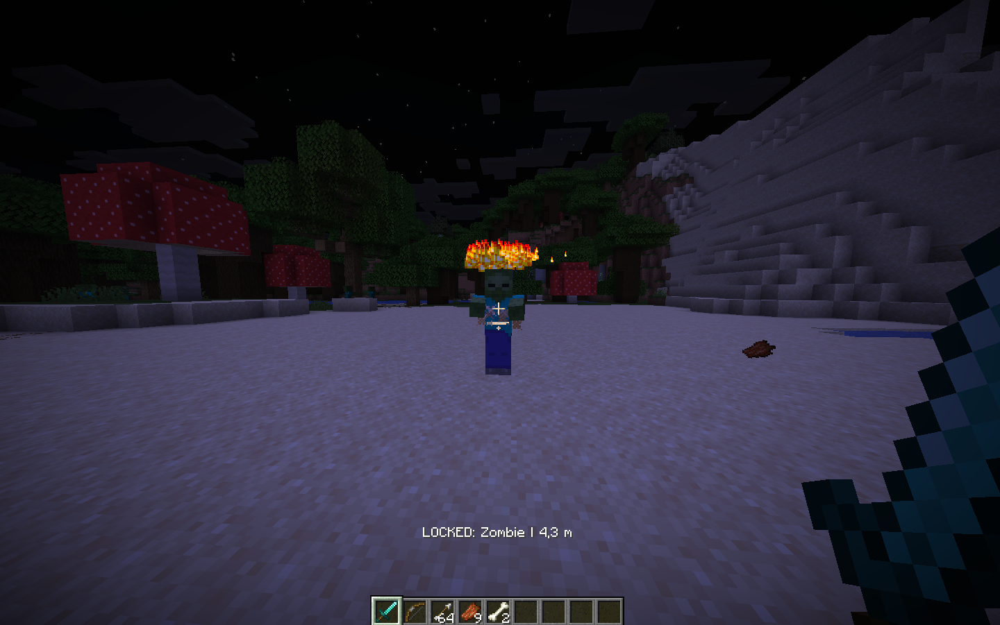

# Minecraft PvE AimPower by QvarcY

  
  
  
  

  <strong>Soft client-side PvE aim assistance for Minecraft.</strong> 
  Hostile mobs only · no player targeting · no automatic attacks

  

  <a href="#latviski">Latviski</a> · <a href="#english">English</a>

**Minecraft:** 26.2 · **Fabric Loader:** 0.19.5+ · **Java:** 25

---

## Latviski

### Kas tas ir

Minecraft PvE AimPower ir client-side Fabric mods PvE cīņām.

Tas ļauj manuāli nofiksēt hostile mobu un palīdz vienmērīgi noturēt kameru uz izvēlētā mērķa bez pēkšņa camera snap.

Spēlētāji ir apzināti izslēgti no target pipeline vairākos līmeņos.

### Funkcijas

- hostile mobu meklēšana līdz 12 blokiem
- mērķa izvēle līdz 45° no skatiena virziena
- line-of-sight pārbaude
- manuāls target lock un release
- automātiska target zaudēšana, ja mobs nomirst, pazūd vai iziet ārpus diapazona
- soft camera tracking
- torso orientēts aim point
- ierobežots yaw un pitch kustības ātrums
- glowing target marķieris
- animēts particle halo
- target nosaukums un attālums actionbar
- hard-coded Player exclusion
- nav auto-attack
- nav automātiskas spēlētāja kustības

### Vadība

| Taustiņš | Darbība |
| --- | --- |
| `G` | AimPower ON / OFF |
| `R` | Lock / release hostile target |

AimPower neizmanto `V`, tāpēc tas nekonfliktē ar QvarcY AutoToolSwitcher noklusēto hotkey.

### Uzstādīšana

Nepieciešams:

1. Minecraft 26.2
2. Fabric Loader 0.19.5 vai jaunāks
3. Fabric API Minecraft 26.2 versijai
4. PvE AimPower JAR

Ievieto JAR savas Minecraft instances `mods` mapē un palaid spēli.

Serverī nekas nav jāinstalē.

### Pašreizējie ierobežojumi

- hostile-only režīms pašlaik ir fiksēts
- range un target cone vēl nav konfigurējami spēlē
- projectile prediction vēl nav pievienots
- nav pilnas konfigurācijas izvēlnes

### Roadmap

- `v0.1.x` — core stabilizācija un kļūdu labojumi
- `v0.2.0` — konfigurācija un paplašināts HUD
- `v0.3.0` — projectile prediction lokam un arbaletam
- `v1.0.0` — nobriedusi stabilā relīze

---

## English

### What is it

Minecraft PvE AimPower is a client-side Fabric mod for PvE combat.

It lets you manually lock onto a hostile mob and provides smooth camera assistance to help keep that target in view without instant snapping.

Players are deliberately excluded from the targeting pipeline at multiple layers.

### Features

- hostile mob scanning within 12 blocks
- target selection up to 45° from the current look direction
- line-of-sight validation
- manual target lock and release
- automatic target loss when the mob dies, disappears, or leaves range
- smooth camera tracking
- torso-biased aim point
- capped yaw and pitch movement
- glowing locked target
- animated particle halo
- live target name and distance in the action bar
- hard-coded Player exclusion
- no automatic attacks
- no automatic player movement

### Controls

| Key | Action |
| --- | --- |
| `G` | Toggle AimPower ON / OFF |
| `R` | Lock / release a hostile target |

AimPower does not use `V`, so it does not conflict with the default QvarcY AutoToolSwitcher hotkey.

### Installation

Requirements:

1. Minecraft 26.2
2. Fabric Loader 0.19.5 or newer
3. Fabric API for Minecraft 26.2
4. PvE AimPower JAR

Place the JAR in your Minecraft instance's `mods` folder and start the game.

Nothing needs to be installed on the server.

### Current limitations

- hostile-only mode is currently fixed
- range and target cone are not yet configurable in-game
- projectile prediction is not implemented yet
- no full configuration screen yet

### Roadmap

- `v0.1.x` — core stabilization and bug fixes
- `v0.2.0` — configuration and expanded HUD
- `v0.3.0` — projectile prediction for bows and crossbows
- `v1.0.0` — mature stable release

---

## Support

- [Buy Me a Coffee](https://buymeacoffee.com/craftin)
- [GitHub Sponsors](https://github.com/sponsors/QvarcY)
- [QvarcY on GitHub](https://github.com/QvarcY)

## License

MIT License

Created by [QvarcY](https://github.com/QvarcY).

Minecraft PvE AimPower is an independent community project and is not affiliated with Mojang or Microsoft.